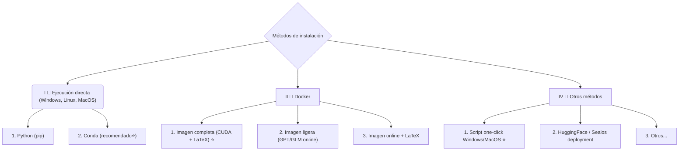
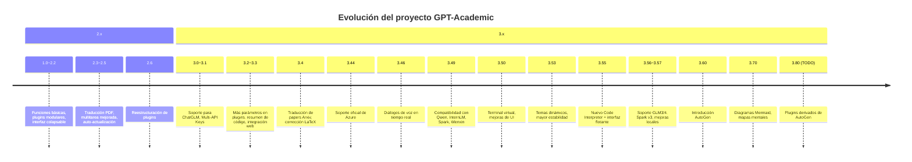

<div align="center">
<h1>
 GPT Académico (GPT Academic)
</h1>

[![Github][Github-image]][Github-url] [![License][License-image]][License-url] [![Releases][Releases-image]][Releases-url] [![Installation][Installation-image]][Installation-url] [![Wiki][Wiki-image]][Wiki-url] [![PR][PRs-image]][PRs-url]  

[Github-image]: https://img.shields.io/badge/github-12100E.svg?style=flat-square  
[License-image]: https://img.shields.io/github/license/Frankcav/gpt_cientifico?label=License&style=flat-square&color=orange  
[Releases-image]: https://img.shields.io/github/release/Frankcav/gpt_cientifico?label=Release&style=flat-square&color=blue  
[Installation-image]: https://img.shields.io/badge/dynamic/json?color=blue&url=https://raw.githubusercontent.com/Frankcav/gpt_cientifico/master/version&query=$.version&label=Installation&style=flat-square  
[Wiki-image]: https://img.shields.io/badge/wiki-Documentación-black?style=flat-square  
[PRs-image]: https://img.shields.io/badge/PRs-welcome-pink?style=flat-square  

[Github-url]: https://github.com/Frankcav/gpt_cientifico  
[License-url]: https://github.com/Frankcav/gpt_cientifico/blob/master/LICENSE  
[Releases-url]: https://github.com/Frankcav/gpt_cientifico/releases  
[Installation-url]: https://github.com/Frankcav/gpt_cientifico#Instalación  
[Wiki-url]: https://github.com/Frankcav/gpt_cientifico/wiki  
[PRs-url]: https://github.com/Frankcav/gpt_cientifico/pulls  
</div>  

---

**Si te gusta este proyecto, por favor deja una ⭐. Si inventaste un buen atajo o plugin, eres bienvenido a enviar un Pull Request.**  

Traducciones disponibles: **[English](docs/README.English.md) | [日本語](docs/README.Japanese.md) | [한국어](docs/README.Korean.md) | [Русский](docs/README.Russian.md) | [Français](docs/README.French.md)**  

> [!NOTE]  
> 1. La explicación detallada de cada archivo está en el [informe de autoanálisis](https://github.com/Frankcav/gpt_cientifico/wiki/GPT‐Academic项目自译解报告) `self_analysis.md`. Puedes regenerarlo siempre que quieras.  
> 2. El proyecto es compatible con modelos chinos como **Qwen (通义千问)** y **ChatGLM**, soportando múltiples API Keys en simultáneo.  

---

## Funcionalidades principales

<div align="center">

Funcionalidad (⭐ = nuevo) | Descripción  
--- | ---  
⭐ [Integración de nuevos modelos](https://github.com/Frankcav/gpt_cientifico/wiki/%E5%A6%82%E4%BD%95%E5%88%87%E6%8D%A2%E6%A8%A1%E5%9E%8B) | Compatibilidad con **Baidu Wenxin**, **Qwen**, **InternLM**, **Spark**, **LLaMA2**, **GLM4**, **DALL·E 3**, **DeepseekCoder**, etc.  
⭐ Soporte para rendering Mermaid | Creación de diagramas de flujo, Gantt, GitGraph, etc. (versión 3.7).  
⭐ Traducción académica Arxiv/PDF | Plugin [con traducción de alta calidad para papers](https://www.bilibili.com/video/BV1dz4y1v77A/).  
⭐ Entrada de voz en tiempo real | [Plugin de audio](https://github.com/Frankcav/gpt_cientifico/blob/master/docs/use_audio.md) que escucha asincrónicamente y responde con contexto.  
⭐ Terminal virtual | Invoca funciones usando lenguaje natural para controlar plugins.  
Traducción y corrección de papers | Similar a Grammarly, con soporte para LaTeX.  
[Atajos personalizados](https://www.bilibili.com/video/BV14s4y1E7jN) | Define atajos propios en la interfaz.  
Diseño modular | Plugins personalizables y con **hot reload**.  
[Análisis de código](https://www.bilibili.com/video/BV1cj411A7VW) | Soporte para Python, C, C++, Java, Lua y más.  
[Lectura y resumen de papers](https://www.bilibili.com/video/BV1KT411x7Wn) | Traducción y resumen completo de documentos LaTeX/PDF.  
[Traducción en bloque de PDFs](https://www.bilibili.com/video/BV1KT411x7Wn) | Traducción del artículo completo de PDF: título, abstract y cuerpo.  
Arxiv Assistant | Ingresa una URL y traduce resumen+descarga PDF automáticamente.  
... | ...  

</div>

---

### Vista previa de interfaz  

<div align="center">  
  
</div>  

<div align="center">  
  
</div>  

Ejemplos:  
- Botones dinámicos desde `functional.py`.  
- Corrección y mejora textual.  
- Visualización simultánea en formato **TeX y renderizado**.  
- Análisis de proyectos completos con un solo clic.  
- Uso combinado de múltiples LLMs (GPT, ChatGLM, OpenAI).  

---

# Instalación



---

### Instalación I: Ejecución directa

```sh
git clone --depth=1 https://github.com/Frankcav/gpt_cientifico.git
cd gpt_cientifico
```

Configura tu `API_KEY` en `config_private.py` y luego instala dependencias:  

```sh
python -m pip install -r requirements.txt
```

Ejecuta el programa:  

```sh
python main.py
```

👉 Hay pasos adicionales opcionales para usar **ChatGLM3/4, MOSS, RWKV** y otros. Revisa la sección avanzada de la documentación.

---

### Instalación II: Docker

- **Imagen completa (CUDA + LaTeX)**: soporte total.  
- **Imagen ligera (solo modelos online)**: recomendado para uso estándar.  

Ejemplo:  
```sh
docker-compose up
```

---

### Instalación III: Otros métodos

- Script **One‑click** en Windows desde [Releases](https://github.com/Frankcav/gpt_cientifico/releases).  
- Uso con HuggingFace, Sealos o WSL2.  

---

# Uso avanzado

### Atajos personalizados (Custom Buttons)

Puedes añadir botones desde la GUI en menú **`自定义菜单`** o editar `core_functional.py`. Ejemplo en Python:

```python
"Super Traducción Inglés → Chino": {
    "Prefix": "Por favor traduce al chino el siguiente párrafo y explica los términos técnicos en una tabla Markdown:\n\n",
    "Suffix": "",
}
```

---

# Actualizaciones recientes

- Guardado y carga de conversaciones en HTML.  
- Traducción de Papers Arxiv y LaTeX.  
- Terminal virtual para interactuar con plugins.  
- UI modular adaptable.  
- Soporte para **Mermaid diagrams** y **mapas mentales**.  
- Integración con múltiples LLMs en simultáneo.  
- Generación de imágenes (OpenAI).  
- Soporte de temas oscuros y Live2D opcional.  

---

# Cronología del proyecto



---

# Temas y configuraciones

Puedes modificar el tema en `config.py` con la variable `THEME`.  
Ejemplo: `Chuanhu-Small-and-Beautiful`.

---

# Ramas de desarrollo

- `master`: versión estable.  
- `frontier`: rama experimental.  

---

> [!IMPORTANT]  
> **Últimos cambios en la rama `master`:**  
> - **2025.8.23**: Optimización significativa de la eficiencia de construcción en Dockerfile.  
> - **2025.7.31**: Nueva interfaz gráfica (GUI), próximamente.  
> - **2025.2.2**: Tutorial “Conéctate en 3 minutos al modelo Qwen2.5‑max” [video](https://www.bilibili.com/video/BV1LeFuerEG4).  
> - **2025.2.1**: Soporte para fuentes personalizadas.  
> - **2024.10.10**: Tras un apagón, se restauró de emergencia el servidor de archivos con los [paquetes .whl](https://drive.google.com/drive/folders/14kR-3V-lIbvGxri4AHc8TpiA1fqsw7SK?usp=sharing).  
> - **2024.5.1**: Nueva función **Doc2x** para traducir artículos académicos en PDF. [Ver detalles](https://github.com/Frankcav/gpt_cientifico/wiki/Doc2x).  
> - **2024.3.11**: Soporte completo para **Qwen, GLM, DeepseekCoder** y módulo de clonación de voz **SoVits**. [Ver más](https://www.bilibili.com/video/BV1Rp421S7tF/).  
> - **2024.1.17**: Al instalar dependencias, usa siempre las versiones exactas de `requirements.txt`.  
>   Comando: `pip install -r requirements.txt`  

---


# Referencias

Este proyecto toma inspiración de:  

- [ChatGLM2-6B](https://github.com/THUDM/ChatGLM2-6B)  
- [JittorLLMs](https://github.com/Jittor/JittorLLMs)  
- [ChatPaper](https://github.com/kaixindelele/ChatPaper)  
- [Edge-GPT](https://github.com/acheong08/EdgeGPT)  
- [ChuanhuChatGPT](https://github.com/GaiZhenbiao/ChuanhuChatGPT)  
- [Oobabooga one‑click installer](https://github.com/oobabooga/one-click-installers)  
- [Gradio](https://github.com/gradio-app/gradio)  
- [Live2D demo](https://github.com/fghrsh/live2d_demo)  

---

**Grupo oficial de desarrolladores (QQ): 610599535**  
**Nota:** evita usar traducción automática del navegador, puede interferir con la interfaz.
